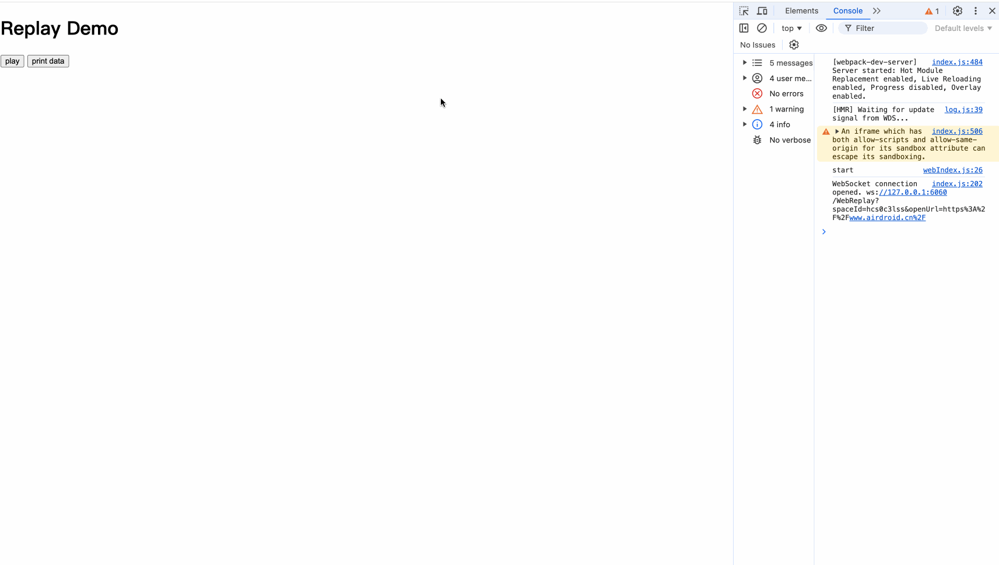

# remote-browser-view
一个简单的远程浏览器工具，可以通过在远程服务器运行浏览器在前端web页面渲染远程浏览器画面，可以实现动作录制和动作回放。
# 适用场景
1.在web页面打开一个第三方网站（非iframe），获取网站的cookie、请求、用户操作等信息，用户在第三方网站的动作可以被记录并且回放。
如捕获用户在www.baidu.com登入的过程，并获取登入后的请求头或者cookie，在适合的时机回放操作过程，但是www.baidu.com实际是在后端的playwright中执行。
# 演示

# 安装
```js
npm install remote-browser-view
```
# 使用
## 后端起监听node服务，创建浏览器和解析url地址。
```
let server = require("remote-browser-view/dist/node/index.cjs")
let start = new server.ServerBrowser(
    {
        "listenAddr":"0.0.0.0",
        "port":6060,
        "headless":false
        //"playwrightProxy":{}   playwright浏览器代理配置，参考import('playwright-core').LaunchOptions
    }
)
start.start()

```
## 前端使用
```
import WebReplayManager from 'remote-browser-view/dist/browser'
let start = new WebReplayManager({
    "target":"https://www.airdroid.cn/",   //要打开的网站地址
    "PlaySelect":"#replay",             //要渲染的dom节点
    "WebSocketUrl":"ws://127.0.0.1:6060/",  //前面部署的node服务地址
    "rrwebReplayConfig":{}   //基于rrweb项目实现，rrweb的配置自定义
})
start.start() //开始渲染url


页面操作完成之后：

获取用户操作动作
console.log("userAction:",start.getWebInteractionActions())
获取第三方网站cookie
console.log("Cookies:",start.getServerBrowserCookies())
获取第三方网站所有请求
console.log("Connections:",start.getServerBrowserConnections(["fetch","xhr","document"]))

```


